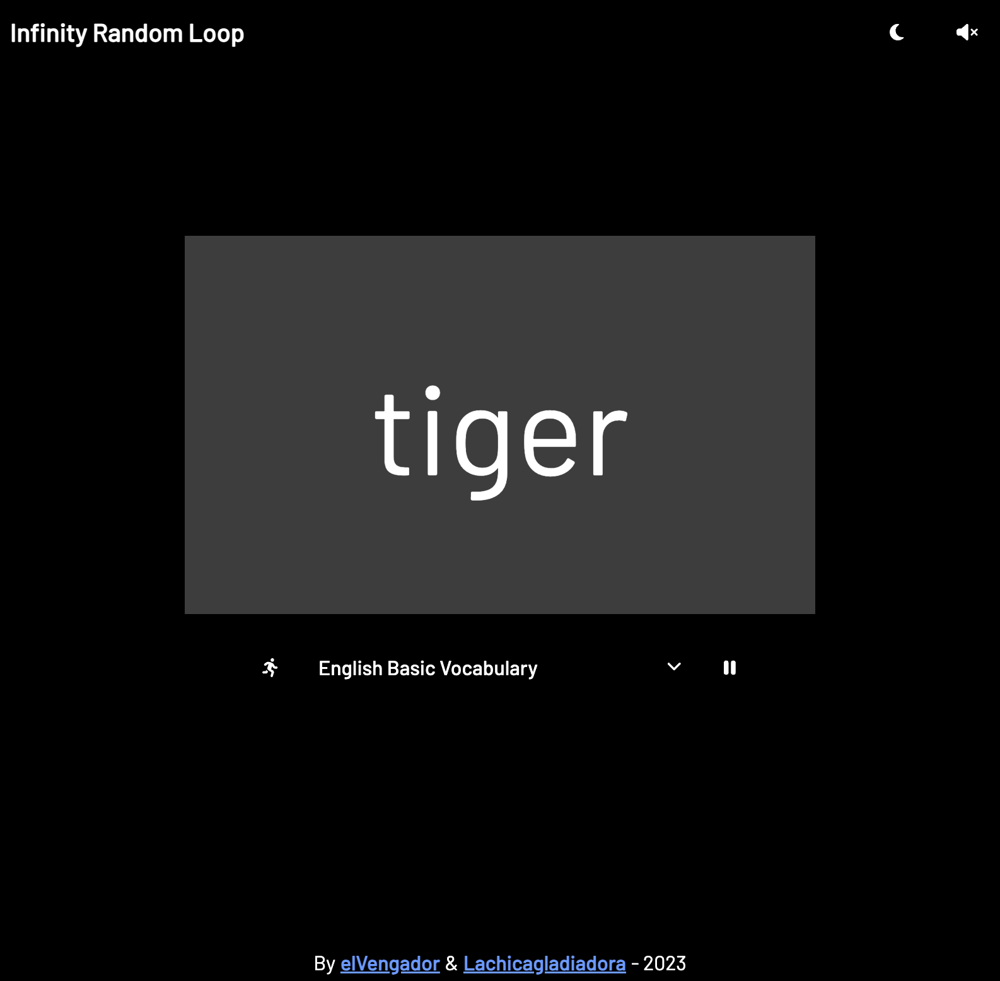

## Random Infinity Loop

<!-- 


 -->



This tool is used to practice repetitive things in random way, for example to practice music notes on guitar.

## Installation
To install, run:
```bash
npm run install
```

## Usage
To use this project, follow these steps:
```bash
npm run dev
```

<!-- ## Contribution
If you want to contribute, follow these steps... -->

## License
This project is licensed under the MIT License - see the [LICENSE](LICENSE) file for more details.

## Credits
Thanks to Lachicagladiadora for helping me to implement some functionalities

## Contact
If you have questions, get in touch with Jimy at dev.jimynicanor@gmail.com.
